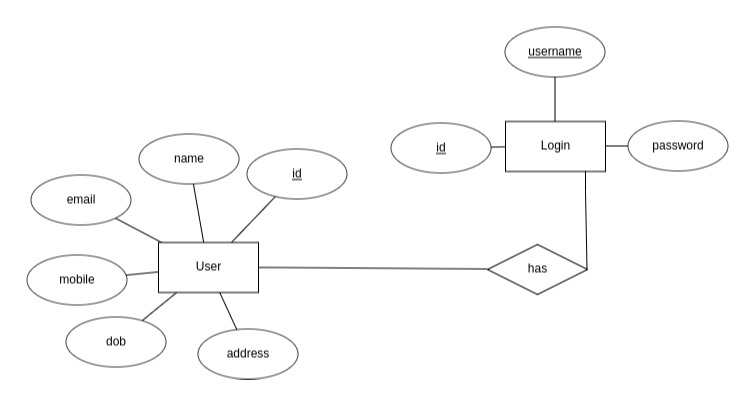

# Team Athena

* M Ranjith    		: AM.EN.U4CSE19331 (Scrum Master)
* Adharsh S Mathew 	: AM.EN.U4CSE19302
* Karthik Narayanan 	: AM.EN.U4CSE19327
* Gokul Krishnan G	: AM.EN.U4CSE19321

### QR Code Based Login System

This is a Java Project that allows users to Register an account and generate a QR code. This QR Code can be later used to login into the system.

##### Motivation

* Conventional login system uses username and password to login to the system. This is time consuming.
* Biometric login system, during current covid times  biometric system that mainly focus on fingerprint authentication systems is a source point for contact.
* QR based login system uses a generation system to generate QR based on the details and a Reader system to read the QR code and do authentication of the user.

# Tech Stack

* API used:
  * Java Swings API
  * JDBC API
  * ZXing API

## Time-Line

* Week 1
  * Meeting 1 : 9/2/2022 : Mode = Discord
    * Work Divison Completed
    * Github Repository Completed
  * Meeting 2 : 12/2/2022 : Mode = Discord
    * Usecase Diagram using diagrams.net
      * https://drive.google.com/file/d/1bDAPKJnq6mYDTJZiOw8iKljOXTDtr9ET/view?usp=sharing
      * 
    * User Stories Completed
    * ER diagram Completed
      * 
* Week 2
  * Meeting 1 : 16/3/2022 : Mode - Teams

    * Meeting Minutes
  * Backlogs
  * | Team Member | Forcast                        | To Do | Progress | Done |
    | ----------- | ------------------------------ | ----- | -------- | ---- |
    | Ranjith     | Initial Class Diagram          |       |          | *    |
    | Karthik     | Code for initial Class Diagram |       | *        |      |
    | Gokul       | Modified Class Diagram         | *     |          |      |
    | Adharsh     | Modified Code                  | *     |          |      |

    Class Diagram v1:
  * 
* Week 3
* Week 4
