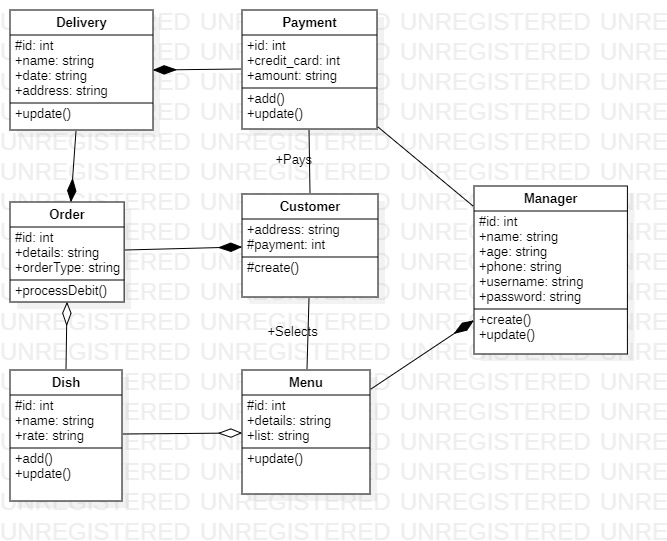
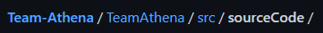
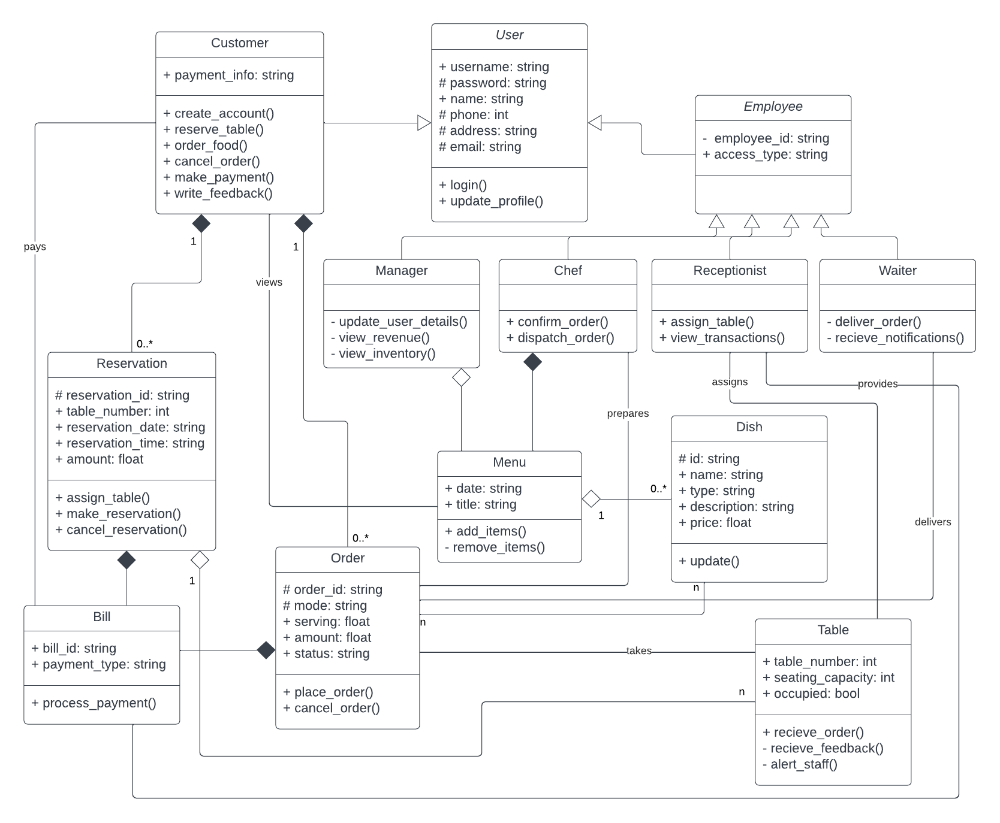
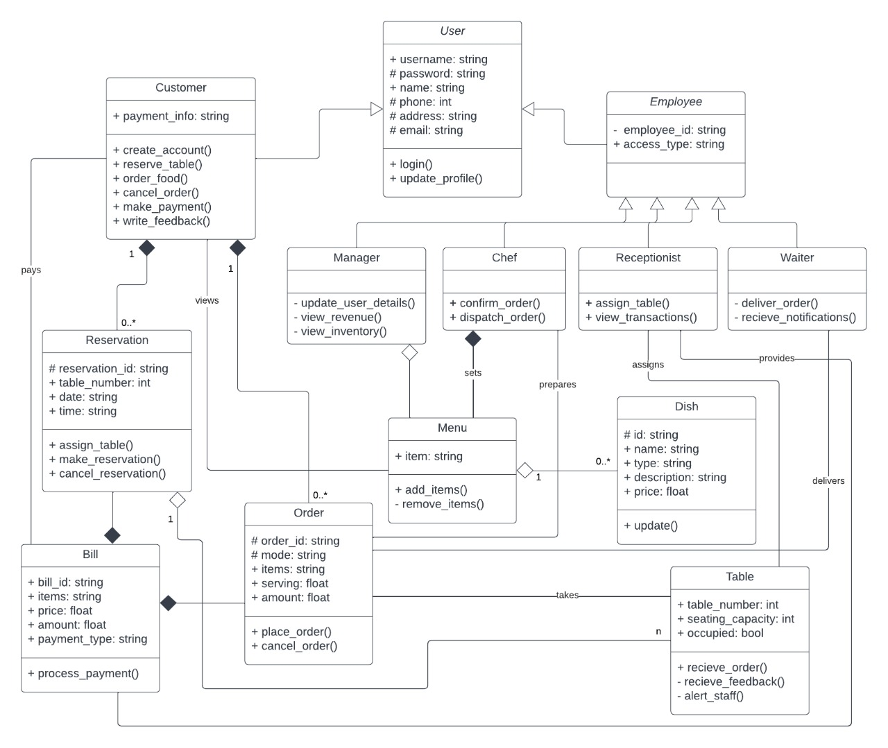

# Team Athena

* M Ranjith    		: AM.EN.U4CSE19331 (Scrum Master)
* Adharsh S Mathew 	: AM.EN.U4CSE19302
* Karthik Narayanan 	: AM.EN.U4CSE19327
* Gokul Krishnan G	: AM.EN.U4CSE19321

# Resturant Management System

The Restruant management system is a GUI based system that can be used  to monitor annd manage the customers information and status. It needs to manage the food information and new items to the menu. It must allow customers to book online as well as dine in. It must keep track on the revenue and expenses and also track the transactions.

# Tech Stack

* API used:
  * Java Swings API
  * JDBC API

## Time-Line

* Week 1

  * Meeting 1 : 9/2/2022 : Mode = Discord
    * Work Divison Completed
    * Github Repository Completed
  * Meeting 2 : 12/2/2022 : Mode = Discord
    * Usecase Diagram using diagrams.net
    
    * User Stories Completed
    * ER diagram Completed
    * Status = Completed
* Week 2

  * Meeting 3 : 8/3/2022 : Mode - Face to Face

    * Disscussion regarding the class diagram is done.
    * Source code to be generated.
    * Necessary refactoring to be done.
  * Meeting 4 : 15 /3/2022: Mode - Face to Face

    * Initial Class Diagram is done.
      * Class Diagram v1:
      * 
    * Source Code is being generated.
      * Path to Source Code
      * 
    * Necessary refactoring is pending.
  * Backlogs
  * | Team Member | Forcast                        | To Do | Progress | Done |
    | ----------- | ------------------------------ | ----- | -------- | ---- |
    | Ranjith     | Initial Class Diagram          |       |          | *    |
    | Karthik     | Code for initial Class Diagram |       | *        |      |
    | Gokul       | Modified Class Diagram         | *     |          |      |
    | Adharsh     | Modified Code                  | *     |          |      |

    Status = Completed
* Week 3

  * Meeting 5 : 22/3/2022 : Mode - Face to Face

    * Initial Class Diagram Done
    * Source code has been generated
    * Making necessary changes to the class diagrams
    * Modified class diagram complete.
      * Class Diagram v2:
      

      * Backlogs

      | Team Member | Forcast                        | To Do | Progress | Done |
      | ----------- | ------------------------------ | ----- | -------- | ---- |
      | Ranjith     | Initial Class Diagram          |       |          | *    |
      | Karthik     | Code for initial Class Diagram |       |          | *    |
      | Gokul       | Modified Class Diagram         |       |          | *    |
      | Adharsh     | Modified Code                  |       | *        |      |

      Status = Pending
  * Meeting 6 : 28/ 3/2022 : Mode - Face to Face

    * Initial Class Diagram done
    * Initial Source Code Done
    * New class diagram Done
      * 
    * New source code generated
    * Backlogs

    | Team Member | Forcast                        | To Do | Progress | Done |
    | ----------- | ------------------------------ | ----- | -------- | ---- |
    | Ranjith     | Initial Class Diagram          |       |          | *    |
    | Karthik     | Code for initial Class Diagram |       |          | *    |
    | Gokul       | Modified Class Diagram         |       |          | *    |
    | Adharsh     | Modified Code                  |       |          | *    |
* Week 4

  * Meeting 7  : 31/3/2022  Mode - Face to Face
  * 

  | Team Member | Forcast     | To Do | Progress | Done |
  | ----------- | ----------- | ----- | -------- | ---- |
  | Ranjith     | Database    |       | *        |      |
  | Karthik     | GUI         |       | *        |      |
  | Gokul       | Source Code |       | *        |      |
  | Adharsh     | Source Code |       | *        |      |
